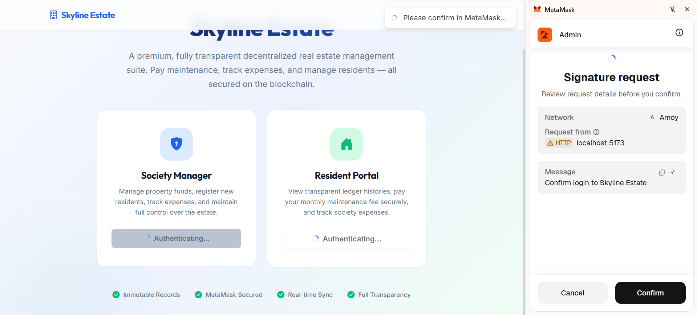
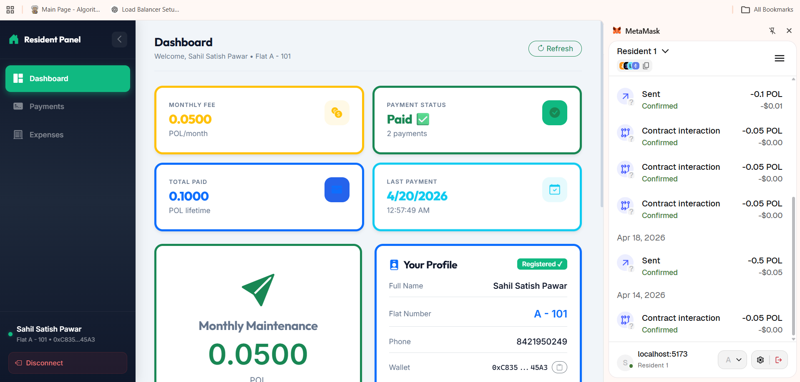

# 🌐 Web Interface + MetaMask Integration

## 📌 Overview

This project demonstrates how a frontend web application interacts with an Ethereum smart contract using MetaMask.
Users can connect their wallet, perform transactions, and view results directly from the browser.

---

## ⚙️ Features

* Connect wallet using MetaMask
* Interact with smart contract functions
* Execute blockchain transactions
* Display transaction results on UI

---

## 🛠️ Technologies Used

* HTML / CSS / JavaScript (or React)
* Ethers.js / Web3.js
* MetaMask (Crypto Wallet)
* Remix IDE (for contract deployment)
* Ethereum Test Network (Sepolia)

---

## 🔗 How Frontend Connects to Blockchain

* The frontend uses **Ethers.js/Web3.js** to communicate with the blockchain
* MetaMask injects a provider (`window.ethereum`) into the browser
* The app connects to this provider to:

  * Access user wallet
  * Send transactions
  * Read smart contract data

---

## 🦊 How MetaMask is Used

* MetaMask acts as a bridge between frontend and blockchain
* It is used to:

  * Connect user wallet
  * Sign transactions securely
  * Pay gas fees
* Every transaction requires user confirmation in MetaMask

---

## 🚀 How to Run the Project

1. Install MetaMask browser extension
2. Connect to Sepolia test network
3. Open the frontend project in browser
4. Click **Connect Wallet**
5. Approve connection in MetaMask
6. Interact with smart contract (e.g., click buttons)
7. Confirm transactions in MetaMask

---

## ▶️ Smart Contract Interaction

* Contract ABI and address are used in frontend
* Functions are called using JavaScript
* Example:

  * Read data → call()
  * Write data → send transaction

---

## 📸 Screenshots

Include the following:

## 📸 Screenshots

### 1. Wallet Connection

### 2. Transaction Execution

---

## 🎯 Conclusion

This project shows how web applications interact with blockchain using MetaMask.
It enables secure, decentralized transactions directly from the browser.

---
