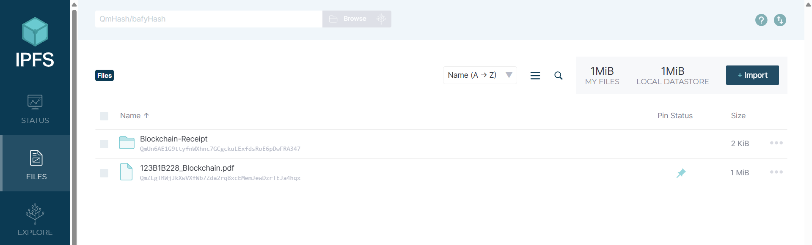
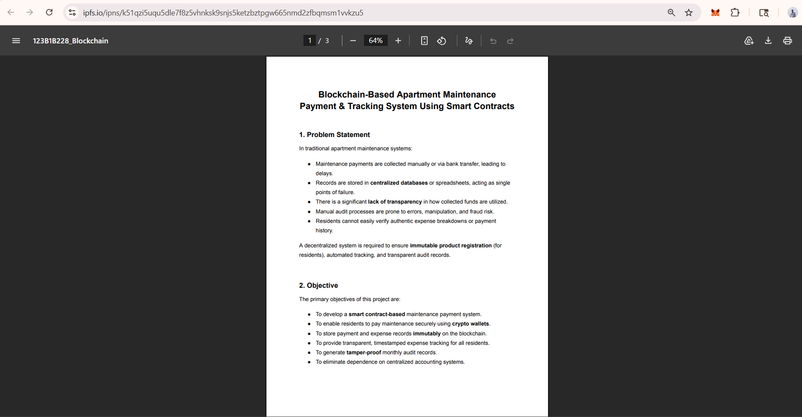
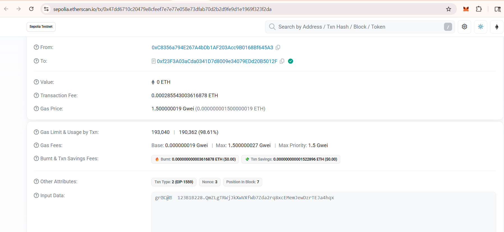

# Assignment 4: IPFS Integration

## 📌 IPFS Service Used
- Local IPFS Desktop Application

---

## 🔄 How Files are Stored

1. Open IPFS Desktop application  
2. Go to **Files** section  
3. Click **Import**  
4. Select a file (image/pdf)  
5. File gets uploaded to IPFS  
6. A unique **CID (Content Identifier)** is generated  

### 🔑 Example CID

QmZLgTRWjJkXwVXfWb7Zda2rq8xcEMemJewDzrTEJa4hqx

---

## 🔄 How Files are Retrieved

1. Copy the generated CID  
2. Open browser  
3. Use any of the following links:

### Local Access

http://127.0.0.1:8080/ipfs/QmZLgTRWjJkXwVXfWb7Zda2rq8xcEMemJewDzrTEJa4hqx

### Public Gateway

https://ipfs.io/ipns/k51qzi5uqu5dle7f8z5vhnksk9snjs5ketzbztpgw665nmd2zfbqmsm1vvkzu5

4. File will open in browser  

---

## 📸 Screenshots

### ✅ 1. File Upload Success + CID

---

### ✅ 2. File Retrieved using CID Link

---

### ✅ 3. Transaction Link (Event Page Only)

---

## 📂 Folder Structure

assignment-4/
│── README.md
│── screenshots/
│ ├── upload.png
│ ├── ipfs-link.png
│ └── transaction.png

---

## ✅ Summary

- File uploaded using Local IPFS  
- CID generated successfully  
- File retrieved using CID link